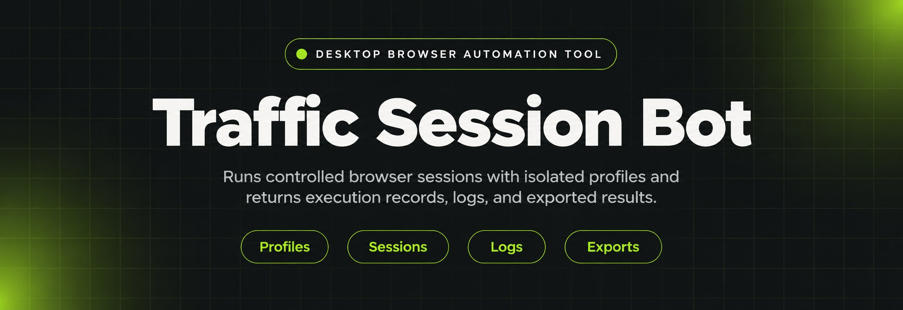
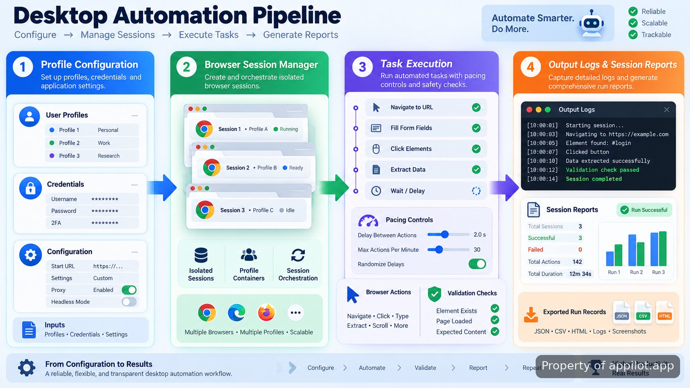

<p align="center">
  <a href="https://www.appilot.app/store/ctr-bot-search-signal-pacing" target="_blank" rel="nofollow">
    
  </a>
</p>

## Appilot's organic search traffic bot

Appilot's organic search traffic bot was built for controlled desktop browser automation where each session needs its own configuration, pacing rules, and output records. The system coordinates browser profiles, task execution, and run history without relying on a shared browser state. It is designed for practitioners who need repeatable desktop automation behaviour and clear visibility into what each session completed.

> Desktop sessions with isolated profiles, controlled actions, and recorded execution paths.

The repository represents the working structure behind a desktop automation system: configuration layers define sessions, execution modules handle browser actions, and reporting components preserve results. The design separates inputs from execution so a failed run can be inspected without rebuilding the entire process.

<a href="https://www.appilot.app/store/ctr-bot-search-signal-pacing" target="_blank" rel="nofollow">
  
</a>

<p align="center">
  <a href="https://t.me/Bitbash333" target="_blank" rel="nofollow">
    
  </a>&nbsp;
  <a href="https://wa.me/923249868488?text=Hi%2C%20I%27m%20interested%20in%20Appilot." target="_blank" rel="nofollow">
    
  </a>&nbsp;
  <a href="mailto:hello@appilot.app" target="_blank" rel="nofollow">
    
  </a>&nbsp;
  <a href="https://www.appilot.app" target="_blank" rel="nofollow">
    
  </a>
</p>



## Core Features

| Feature | Description |
| --- | --- |
| Profile-Based Browser Sessions | The problem of shared browser state causing inconsistent runs is removed by keeping session settings separated. Each profile stores its own browser context, configuration values, and execution history. |
| Controlled Action Scheduling | Repeated manual browser activity becomes difficult to maintain when timing changes between runs. The scheduler applies configured delays, task order, and session limits before actions are executed. |
| Session Logging and Output Records | Unclear results make automation difficult to audit. The system records completed actions, failures, timestamps, and generated outputs for later review. |
| Desktop Browser Environment Handling | Browser automation can break when environments are inconsistent. The system manages browser launch settings and runtime configuration so executions follow the same defined process. |
| Configuration-Driven Workflows | Changing every run manually creates avoidable errors. Configuration files define inputs, session parameters, and task settings without changing the automation logic. |

## How the Runtime Is Structured

The build separates control logic from browser interaction. The session manager creates isolated environments, the automation engine performs configured actions, and the reporting layer captures the final state. This separation makes it possible to identify whether a problem came from configuration, execution, or output handling.

The browser layer follows documented automation patterns from tools such as <a href="https://playwright.dev/docs/intro" target="_blank" rel="nofollow">Playwright</a> and <a href="https://www.selenium.dev/documentation/webdriver/" target="_blank" rel="nofollow">Selenium WebDriver</a>. The implementation keeps browser commands explicit so each action can be traced through logs rather than hidden behind uncontrolled scripts.

```bash
appilot-automation/
├── config/
│   ├── profiles.json
│   ├── schedules.json
│   └── environment.yaml
├── engine/
│   ├── browser_manager.py
│   ├── session_runner.py
│   └── task_queue.py
├── profiles/
│   └── profile_store/
├── reports/
│   ├── execution_logs/
│   └── exports/
├── tests/
│   ├── test_sessions.py
│   └── test_tasks.py
└── main.py
```

## Automation Workflow

A typical run starts with a prepared profile configuration. The runner loads session settings, opens the required browser environment, performs the defined sequence, checks completion states, and stores the resulting records. A 15-minute session, for example, can be reviewed through its timestamps, action history, and completion output rather than relying on a visual check alone.

The workflow is designed around repeatability. If a session fails during browser loading, the error is isolated to that execution record. If a configuration value changes, the same engine can process the updated settings without changing the underlying modules.

<a href="https://tally.so/r/yP5oDx?platform=GitHub&amp;format=Product+repo&amp;brand=Appilot&amp;niche=appilot&amp;page=Organic+Search+Traffic+Bot+for+Desktop+Automation&amp;date=2026-09-04" target="_blank" rel="nofollow">
  
</a>

## Technical Environment

The system uses standard desktop automation components: browser drivers, profile storage, configuration files, and logging services. Browser behaviour can be inspected through official resources such as the <a href="https://chromedevtools.github.io/devtools-protocol/" target="_blank" rel="nofollow">Chrome DevTools Protocol documentation</a> and <a href="https://www.chromium.org/developers/" target="_blank" rel="nofollow">Chromium documentation</a>.

The implementation approach follows measurable execution rules. Each run has defined inputs, a sequence of actions, and an output state. This makes maintenance work focused because changes can be applied to individual layers instead of the entire project.

## Practical Applications

- Automation teams can manage repeated browser-based research sessions with separate profiles and recorded completion logs.
- Operations teams can run scheduled desktop tasks where every execution needs a traceable history and defined parameters.
- Developers maintaining browser workflows can test changes against isolated environments before moving updates into regular runs.

## How to Start Search Sessions Using Appilot's organic search traffic bot

- **STEP 1 — Download & Set Up the Project**
Download, set up, and install <a href="https://www.appilot.app/store/ctr-bot-search-signal-pacing" target="_blank" rel="nofollow"><b>Appilot's organic search traffic bot</b></a> to get the project running. If you hit any difficulty, contact the Appilot team through the project support channel.
- **STEP 2 — Load Profiles**
Open the tool and load the prepared browser profiles, environment settings, and session configuration from the project workspace.
- **STEP 3 — Configure Runs**
Select the execution mode, adjust session fields, and define the task parameters exposed by the configuration layer.
- **STEP 4 — Execute and Review**
Start the configured run, then review generated logs, timestamps, and exported records from the reports directory.

## Repository Maintenance and Extensions

Desktop automation projects often change after deployment because browser versions, workflows, and reporting requirements evolve. Appilot maintains related automation work including custom feature development, deployment support, monitoring, and integration work for existing systems.

For teams evaluating browser automation quality, external references such as the <a href="https://csrc.nist.gov/Projects/ssdf" target="_blank" rel="nofollow">NIST Secure Software Development Framework</a> and the <a href="https://developers.google.com/search/docs" target="_blank" rel="nofollow">Google Search Central documentation</a> provide useful background on software practices and search ecosystem behaviour.

## Measurement and Review

The system measures execution through stored records rather than assumptions. A completed run includes session identifiers, action timing, and result files. Teams can compare runs over time by reviewing the same fields, making changes easier to verify.

A practical review cycle checks three areas: whether profiles loaded correctly, whether configured actions completed in order, and whether output files match the expected format. This approach reduces debugging time because every stage leaves a visible record.

## Repository Reference

The project layout keeps execution code, configuration, tests, and reports separated. Developers can update browser handling without rewriting configuration files, while operators can adjust session values without touching the core engine.

## FAQ

### How does the desktop automation system handle browser sessions?

The system handles browser sessions through isolated profiles, stored configuration values, and separate execution records. Each session keeps its own state so failures and changes can be traced to a specific run.

### Can the automation run with separate profiles and saved settings?

Yes. The workflow uses profile configuration files and saved environment settings to prepare separate browser sessions. Operators can adjust stored parameters without changing the execution modules.

### What data does the system return after a completed run?

A completed run returns execution records including timestamps, session information, action history, and exported files stored through the reporting layer. These records allow each execution to be reviewed after completion.

<table>
  <tr>
    <td align="center" width="33%">
      
      <p>This scraper helped me gather thousands of posts effortlessly. The setup was fast, and exports are super clean and well-structured.</p>
      <p><b>Nathan Pennington</b><br>Marketer<br>★★★★★</p>
    </td>
    <td align="center" width="33%">
      
      <p>What impressed me most was how accurate the extracted data is. Likes, comments, timestamps — everything aligns perfectly.</p>
      <p><b>Greg Jeffries</b><br>SEO Affiliate Expert<br>★★★★★</p>
    </td>
    <td align="center" width="33%">
      
      <p>It's by far the best tool I've used. Ideal for trend tracking, competitor monitoring, and influencer insights.</p>
      <p><b>Karan</b><br>Digital Strategist<br>★★★★★</p>
    </td>
  </tr>
</table>